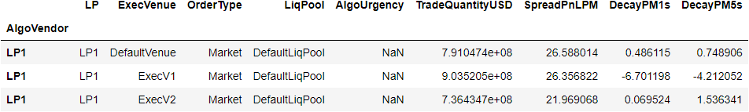
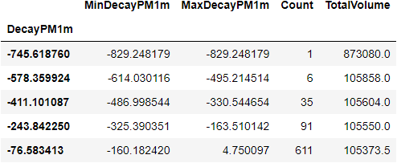

# Functions

## Introduction

This page provides you an overview of the different functions available to you when querying the Tradefeedr APIs. 

- The aggreggation functions are applied to the `select` statements in the query. You need to make sure in the query you have selected, `select` and `groupby` parameters. If `groupby` is not present no aggregation takes place.

- The modification functions are applied to the `filter` and `groupby` statements in the query.

- The transformation functions can be used in the `filter`, `select` and `groupby`.

These functions allow you to create user defined field names.

Note that the modifcation and transformation functions are many to many functions and applied before aggregation.

## Aggreggation Functions
The table below lists all the available aggregation functions that you can use.
There are also examples in the table below for you to use and modify.
They are used in the select query if a `groupby` is present.

```csv
Function,Description,Example
sum,sum,"{""function"":""sum"",""var"":""TradeQuantityUSD"",""name"":""TotalVolume""},"
avg,average,"{""function"":""avg"",""var"":""TradeQuantityUSD"",""name"":""AvgTradeSize""}"
dev,standard deviation,"{""function"":""dev"",""var"":""TradeQuantityUSD"",""name"":""DevTotalSize""},"
max,maximum,"{""function"":""max"",""var"":""TradeQuantityUSD"",""name"":""MaxTradeSize""},"
min,minimum,"{""function"":""min"",""var"":""TradeQuantityUSD"",""name"":""MinTradeSize""},"
count,count,"{""function"":""count"",""var"":""TradeQuantityUSD"",""name"":""NumberOfTrades""},"
first,first observation,"{""function"":""first"",""var"":""TradeTime"",""name"":""FirstTime""}"
last,last observation,"{""function"":""last"", ""var"":""TradeTime"",""name"":""LastTime""}"
percentile,returns the x percentile of the specified column,"{""function"": ""percentile"", ""var"": ""SpreadPnLPM"", ""par"": 90}"
```

## Modification Functions
These are used in the `filter` and `groupby` parameters.

```csv
Function,Description,Example
eqx,"applied to sting variables,returns the value of parament if variable is equal to parameter and “Other” otherwise","{""function"":""eqx"",""par"":""LP1"",""var"":""LP""}"
bar,"rounds the variable down to the nearest multiple of the parameter, used to group to generate equal spaced buckets","{""function"":""bar"",""par"":""10"",""transform"":""minute"",""var"":""TradeTime""}"
minute,take the minute component from the variable,"{""function"":""bar"",""par"":""10"",""transform"":""minute"",""var"":""TradeTime""}"
in,"returns True if the variable is in the List and False otherwise, mainly for filters","{""function"":""in"",""var"":""Symbol"",""pars"":[""EURUSD"",""USDJPY""]},"
within,"within, variable within a provided range","{""function"":""within"",""var"":""date"",""pars"":[""2014-01-01"",""2021-11-30""]},"
gt,return True if the variable is greater than its parameter and False otherwise,"{""function"":""gt"",""var"":""TradeQuantityUSD"",""par"":1000000}, # greater than"
lt,return True if the variable is less than its paramer and False otherwise,"{""function"":""lt"",""var"":""SpreadPnLPM"",""par"":300}, # less than"
eq,returns True is the variable is equal to function parameter and false otherwise,"{""function"":""eq"",""var"":""Symbol"",""par"":""EURUSD""}"
hist,"split the variable into categories with N equally spaced buckets, typically used in group-by to produce histograms, function returns middle value of the bucket","{""function"":""hist"",""var"":""SpreadPnLPM"",""par"":""10""}"
hist_label,"split the variable into categories with N equally spaced buckets, function returns the bucket with the bucket number","{""function"":""hist_label"",""var"":""SpreadPnLPM"",""par"":""10""}"
hist_range,"split the variable into categories with N equally spaced buckets, function returns the range of the bucket","{""function"":""hist_range"",""var"":""SpreadPnLPM"",""par"":""10""}"
hist_index,"split the variable into categories with N equally spaced buckets, function returns the index of the bucket","{""function"":""hist_index"",""var"":""SpreadPnLPM"",""par"":""10""}"
like,matches string based on wild card pattern,"{""function"":""like"",""var"":""Symbol"",""pars"":""*USD""}"
not_eq,not equal. To exclude variables,"{""function"":""not_eq"",""var"":""Symbol"",""par"":""EURUSD""}"
not_in,"not in. returns False if the variable is in the List and True otherwise, mainly for filters","{""function"":""not_in"",""var"":""Symbol"",""pars"":[""EURUSD"",""USDJPY""]}"
rank_percentile,function transforms the target column into a value in the range of [0;100],"{""function"": ""within"", ""var"": ""DecayPM1s"", ""transform"": ""rank_percentile"", ""pars"": [10, 90]}"
within_percentile,function filters the dataset to within target percentile range of the target column,"{""function"": ""within_percentile"", ""var"": ""DecayPM1s"", ""pars"": [10, 90]}"
diff_millis,"function takes two time columns x,y and performs an subtraction x-y results are in milliseconds","{""function"": ""within"", ""var"": [""TradeTime"", ""ArrivalTime""], ""transform"": ""diff_millis"", ""pars"": [0, 500]}"
diff_nanos,"function takes two time columns x,y and performs an subtraction x-y results are in nanoseconds","{""function"": ""within"", ""var"": [""TradeTime"", ""ArrivalTime""], ""transform"": ""diff_nanos"", ""pars"": [0, 500]}"
minus,"function takes two columns x,y and performs an subtraction x-y.","{""function"": ""within"", ""var"": [""OrderExecutionScore"", ""OrderReversalScore""], ""transform"": ""minus"", ""pars"": [0, 500]}"
plus,"function takes two columns x,y and performs an additon x+y.","{""function"": ""within"", ""var"": [""OrderExecutionScore"", ""OrderReversalScore""], ""transform"": ""plus"", ""pars"": [80, 150]}"
```

## Transformation Functions
Used to transform the column type. Commonly used on time columns in the `filter` and `select` parameters.

```csv
Function,Description,Example
month,Transforms datetime/date column type to date month in yyyy-mm-01 format,"{""var"": ""Date"", ""transform"": ""month"", ""name"": ""Month""}"
date,Transforms datetime/date column type to date in yyyy-mm-dd format,"{""var"": ""ArrivalTime"", ""transform"": ""date"", ""name"": ""ArrivalDate""}"
minute,Transforms datetime/time column type to minutes,"{""var"": ""ArrivalTime"", ""transform"": ""minute"", ""name"": ""ArrivalMin""}"
second,Transforms datetime/time column type to seconds,"{""var"": ""ArrivalTime"", ""transform"": ""second"", ""name"": ""ArrivalSec""}"
time,Transforms datetime/time column type to timestamp HH:MM:SS,"{""var"": ""ArrivalTime"", ""transform"": ""time"", ""name"": ""ArrivalTime""}"
date_london ,Transforms datetime/date columntype to london date in yyyy-mm-dd format,"{""var"": ""Date"", ""transform"": ""date_london"", ""name"": ""LondonDate""},"
minute_london ,Transforms datetime/time column type to london time in minutes,"{""var"": ""ArrivalTime"", ""transform"": ""minute_london"", ""name"": ""ArrivalLondonMin""},"
second_london ,Transforms datetime/time column type to london time in seconds,"{""var"": ""ArrivalTime"", ""transform"": ""second_london"", ""name"": ""ArrivalLondonSec""},"
date_new_york ,Transforms datetime/date column type to New York date in yyyy-mm-dd format,"{""var"": ""Date"", ""transform"": ""date_new_york"", ""name"": ""NYDate""},"
minute_new_york,Transforms datetime/time column type to New York  time in minutes,"{""var"": ""ArrivalTime"", ""transform"": ""minute_new_york"", ""name"": ""ArrivalNYMin""},"
second_new_york,Transforms datetime/time column type to New York  time in seconds,"{""var"": ""ArrivalTime"", ""transform"": ""second_new_york"", ""name"": ""ArrivalNYSec""},"
date_trading   ,Transforms datetime/date column type to trading date in yyyy-mm-dd format,"{""var"": ""Date"", ""transform"": ""date_trading"", ""name"": ""TradingDate""},"
minute_trading,Transforms datetime/time column type to trading time in minutes,"{""var"": ""ArrivalTime"", ""transform"": ""minute_new_york"", ""name"": ""ArrivalTradingMin""},"
second_trading ,Transforms datetime/time column type to trading time in seconds,"{""var"": ""ArrivalTime"", ""transform"": ""second_new_york"", ""name"": ""ArrivalTradingSec""},"
```

##  Algo API Example

### Aggregation and Modification Functions

You can apply aggregation functions (such as `sum`, `avg`, `dev`,`max`,`min`,`count`,`first` and `last`) to the same variable (`TradeQuantityUSD`). 
In this case you can name the resulting column as you wish.

=====
```python
```
## tradefeedr library
from tradefeedr_public_content.v1.generic.tradefeedr_api import TradefeedrApi

## need pandas to translate JSON results from API
import pandas as pd

## create API object
tf_api_object = TradefeedrApi(demo=True)

## options
options = {
    "groupby": [
        "LP"
    ],
    "select": [
        {"function": "sum", "var": "TradeQuantityUSD", "name": "TotalVolume"},
        {"function": "avg", "var": "TradeQuantityUSD", "name": "AvgTradeSize"},
        {"function": "dev", "var": "TradeQuantityUSD", "name": "DevTotalSize"},
        {"function": "max", "var": "TradeQuantityUSD", "name": "MaxTradeSize"},
        {"function": "min", "var": "TradeQuantityUSD", "name": "MinTradeSize"},
        {"function": "count", "var": "TradeQuantityUSD", "name": "NumberOfTrades"},
        {"function": "first", "var": "TradeTime", "name": "FirstTime"},
        {"function": "last", "var": "TradeTime", "name": "LastTime"}
    ],
    "filter": [
        {"function": "eq", "var": "Symbol", "par": "EURUSD"},
        {"function": "eq", "var": "ParentChild", "par": "Child"}
    ],
}

# this is api end-point which returns execution stats
endpoint = "v1/fx/algo/execution-stats"

## call the API
response = tf_api_object.query_api(endpoint, options)

## translate API result into pandas dataframe
data_frame = pd.DataFrame(response["result"])
# data_frame = data_frame.set_index("AlgoVendor")
data_frame
```
```
=====

#### Results



### Aggregation, Modification and Transformation Functions

The `bar` modification function is applied alongside the `minute` transformation function.
This allows you to analyse intraday execution pattern.

If you seek to view the intraday execution pattern in different time zone. For example, London time use the `minute_london` transformation function instead.

The `ArrivalTime` variable in the `groupby` below is transformed in `HH:MM` format and is then rounded down to the nearest multiple of `par`. 

For example, 11:20 becomes 11:00. 
The buckets such as 11:00 (including all times from 11:00 and 11:29) and 11:30 (including all times from 11:30 to 11:59) are then used for aggregation.  

```python
```
## tradefeedr library
from tradefeedr_public_content.v1.generic.tradefeedr_api import TradefeedrApi

## need pandas to translate JSON results from API
import pandas as pd
from time import strftime, gmtime

## create API object
tf_api_object = TradefeedrApi(demo=True)

## options
options = {
    "groupby": [
         {"function": "bar", "transform": "minute", "var": "ArrivalTime", "par": 30}
    ],
    "select": [
        "NumRuns",
        "TradeQuantityUSD",
        "ArrivalMidPerfBPS",
        "TWAPMidPerfBPS",
        "RiskTransferPricePerfBPS" ],
    "filter": [
        {"function": "within", "var": "Date", "pars": ["2018-01-01", "2018-12-31"]}
    ],
    "risk_price_benchmark": "TradefeedrModel",
    "notation": "performance"
}

# this is api end-point which returns parent order stats
endpoint = "v1/fx/algo/parent-order-stats"

## call the API
response = tf_api_object.query_api(endpoint, options)

## translate API result into pandas dataframe
data_frame = pd.DataFrame(response["result"])
select_index = data_frame.ArrivalTime != "TOTAL"
data_frame.loc[select_index, "ArrivalTime"] = data_frame.loc[select_index, "ArrivalTime"] if isinstance(data_frame.loc[select_index, "ArrivalTime"].iloc[0], str) else data_frame.loc[select_index, "ArrivalTime"].apply(lambda x: strftime("%H:%M:%S", gmtime(x["i"]*60)))

# data_frame = data_frame.set_index("ArrivalTime")
data_frame
```
```
## RFS API Examples

### Aggregation and Modification Functions

Group modification function `hist` (stands for histogram buckets) splits the incoming variable range (`DecayPM1m` in the below example) into a number of buckets of the same size.  Variables in the `select` operator are aggregated within those buckets. 

**Note**: The resulting column created by applying `hist` in the groupby, returns the middle value of the bucket.

=====
```python
```
## tradefeedr library
from tradefeedr_public_content.v1.generic.tradefeedr_api import TradefeedrApi

## need pandas to translate JSON results from API
import pandas as pd

## create API object
tf_api_object = TradefeedrApi(demo=True)

## options
options = {
    "groupby": [
        {"function": "hist", "var": "DecayPM1m", "par": 10}
    ],
    "select": [
        {"function": "min", "var": "DecayPM1m", "name": "MinDecayPM1m"},
        {"function": "max", "var": "DecayPM1m", "name": "MaxDecayPM1m"},
        {"function": "count", "var": "Symbol", "name": "Count"},
        {"function": "min", "var": "TradeQuantityUSD", "name": "TotalVolume"}
    ],
    "filter": [
        {"function": "within", "var": "Date", "pars": ["2014-01-01", "2021-11-30"]},
        {"function": "eq", "var": "ParentChild", "par": "Child"},    # only consider child orders which represent the actual trading
        {"function": "eq", "var": "OrderStatus", "par": "F"},        # only consider fills
        {"function": "gt", "var": "TradeQuantityUSD", "par": 0},     # ignore order with zero traded quantity
        {"function": "eq", "var": "Symbol", "par": "EURUSD"}
    ],
}

# this is api end-point which returns execution stats
endpoint = "v1/fx/rfs/execution-stats"

## call the API
response = tf_api_object.query_api(endpoint, options)

## translate API result into pandas dataframe
data_frame = pd.DataFrame(response["result"])
# data_frame = data_frame.set_index("DecayPM1m")
data_frame
```
```
=====

#### Results



### Modification and Transformation Functions

The `rank_percentile` function transforms the target column into a value in the range of [0;100].

This is applied in the `filter` option. The user can use this function to apply an outlier filtering. `DecayPM1s` results are filtered to only select values which fall within the 10th-90th percentile range.

**Warning**: This function is computationally intensive running on a large data set will results in a slower response time.

=====
```python
```
## tradefeedr library
from tradefeedr_public_content.v1.generic.tradefeedr_api import TradefeedrApi

## need pandas to translate JSON results from API
import pandas as pd

## create API object
tf_api_object = TradefeedrApi(demo=True)

## options
options = {
    "groupby": [
        "LP"
    ],
    "select": [
        "TradeQuantityUSD", # sum
        "SpreadPnLPM",      # TradeQuantityUSD-weighted average
        "DecayPM1s",        # TradeQuantityUSD-weighted average
    ],
    "filter": [
        {"function": "within", "var": "Date", "pars": ["2017-01-01", "2017-04-01"]},
        {"function": "within", "var": "TradeTime", "transform": "time", "pars": ["12:00:00", "14:00:00"]},
        {"function": "within", "var": "DecayPM1s", "transform": "rank_percentile", "pars": [10, 90]}
    ]
}

# this is api end-point which returns execution stats
endpoint = "v1/fx/rfs/execution-stats"

## call the API
response = tf_api_object.query_api(endpoint, options)

## translate API result into pandas dataframe
data_frame = pd.DataFrame(response["result"])
# data_frame = data_frame.set_index("LP")
data_frame
```
```
=====

#### Results


### Time Transformation Functions

In the below example we show how to transform `TradeTime` into London date, New York date and trading date.
The time transformations can be applied to Algo and RFQ APIs as well. 

=====
```python
```
## tradefeedr library
from tradefeedr_public_content.v1.generic.tradefeedr_api import TradefeedrApi

## need pandas to translate JSON results from API
import pandas as pd

## create API object
tf_api_object = TradefeedrApi(demo=True)

## options
options = {
      "groupby":[
          {"transform": "date_london", "var": "TradeTime", "name":"LondonDate"},
          {"transform": "date_new_york", "var": "TradeTime", "name":"NewYorkDate"}, ## this is just calendar in NY time 
          {"transform": "date_trading", "var": "TradeTime", "name":"TradeDate"},    ## this is 5pm to 5pm NY time, value date
          
          ##  This aggregates by minute, par controls how many minutes, par=30 mean every 30 minutes
          ##  for example from 09:00 to 09:30
          #  {"function": "bar", "transform": "minute_london", "var": "TradeTime", "par": 30}
          
          ##  This aggregates by seconds in london time, 
          #   or controls how many second, par=30 mean every 30 seconds
          ##  for example from 09:00:00 to 09:00:30
          #   {"function": "bar", "transform": "second_london", "var": "TradeTime", "par": 1}
          
        ],
    "select": [
        "TradeQuantityUSD",
        {"function": "count", "var": "Symbol", "name": "NumEvents"}
    ], 
    "filter":[
        {"function": "within", "var": "Date", "pars": ["2017-01-01", "2017-04-28"]},
    ],
}

# this is api end-point which returns execution stats
endpoint = "v1/fx/rfs/execution-stats"

## call the API
response = tf_api_object.query_api(endpoint, options)

## translate API result into pandas dataframe
data_frame = pd.DataFrame(response["result"])
# data_frame = data_frame.set_index("DecayPM1m")
data_frame
```
```
=====

## RFQ API Example

### Aggregation, Modification and Transformation Functions

Similar to the Algo example above but we have applied a transformation function to the `TradeTime` column.

```python
```
## tradefeedr library
from tradefeedr_public_content.v1.generic.tradefeedr_api import TradefeedrApi

## need pandas to translate JSON results from API
import pandas as pd

## create API object
tf_api_object = TradefeedrApi(demo=True)

## options
options =  {
    "groupby":[
        "LP",
        "Symbol",
        "Side"
    ],
    "select":[
        {"function": "sum", "var": "TradeQuantityUSD", "name": "TotalVolume"},      # explicit aggregation function
        {"function": "avg", "var": "TradeQuantityUSD", "name": "AvgTicketSize"},
        {"function": "max", "var": "TradeQuantityUSD", "name": "MaxTicketSize"},
        {"function": "min", "var": "TradeQuantityUSD", "name": "MinTicketSize"},
        {"function": "max", "var": "Price", "name": "MaxPrice"},
        {"function": "min", "var": "Price", "name": "MinPrice"},
        "Price",
        {"function": "dev", "var": "Price", "name": "StdPrice"},
        {"function": "avg", "var": "NumLPs", "name": "AvgNumLPs"},
    ],
    "filter": [
        {"function": "within", "var": "Date", "pars": ["2014-01-01", "2021-11-30"]},
        {"function": "within", "var": "TradeTime", "transform": "time", "pars": ["12:00:00", "14:00:00"]},
        {"function": "in", "var": "Symbol", "pars": ["EURUSD", "USDJPY"]},
    ],
}

# this is api end-point which returns RFQ outrights execution stats
endpoint =  "v1/fx/rfq-outrights/execution-stats"

## call the API
response = tf_api_object.query_api(endpoint, options)

## translate API result into pandas dataframe
data_frame = pd.DataFrame(response["result"])
# data_frame = data_frame.set_index("LP")
data_frame
```
```
#### Results

