# Getting Started

### Introduction <a href="#introduction" id="introduction"></a>

This document is based on the "Getting Started" Jupyter notebook available on Tradefeedr platform (`getting_started.ipynb`).

The aim of this document is to provide a basic overview of the Traderfeedr APIs and example use cases. The examples below outline some of the use cases so that you can become familiar with how to query and run the APIs.

Further details and examples for each API endpoint can be found within the links below.

### API Logic

Conceptually, each API call has two components:

1. The first component is the API endpoint, it can be thought of as a function doing specific job. For example, breaking down the `v1/fx/algo/parent-orders` API endpoint:
   * Version: `v1` - Version 1
   * Asset Class: `fx` - Forex
   * Product Type: `algo` - Algorithmic Trading
   * Function: `parent-orders` - Parent Orders function
2. The second component is the `JSON` query, it contains a set of parameters for the API endpoint function. This determines the output of the query. The exact structure of the query string depends on the endpoint and what parameters the endpoint can handle. Below are some examples of commonly found parameters:
   * `select` - is used to specify which fields should be returned from the dataset
   * `groupby` – it is the field/fields that the query partitions result rows into groups. There is usually a default aggregation logic applied or you can define functions to aggregate the results. The result of the query is a row per group.
     * For example, if we take the `v1/fx/algo/parent-order-stats` endpoint and select `TradeQuantityUSD` and `{'groupby':['Symbol']}`, it would return a row per `Symbol` with the total `TradeQuantityUSD` for the respective `Symbol`
   * `var` - is commonly used when defining a user defined function. For instance selecting the average `TradeQuantityUSD`. You could pass the below function in the select query: `{"function": "sum", "avg": "TradeQuantityUSD", "name": "AverageVolume"}`
   * `filter` - how to filter the results this could be time of day, `Symbol` etc . An example could be applying a date-range filter: `{"function": "within", "var": "Date", "pars": ["2014-01-01", "2021-11-30"]}`
   * `domain`- is the range of the possible variables in the database. For symbol-like variables the whole selection is returned while for floats and dates only min and max (range) is returned by API if `domain` is requested.

All API end-points return a `JSON` dictionary that can translated into the Python Pandas.

### API Groups

Tradefeedr API can be split into the following groups:

* `Algo API` - Covers algo execution workflows. The set of Tradefeedr Algo APIs allows you to perform any task from calculating top level algo performance summary table to investigating the quality of individual child fills
* `RFS API` - Covers request for stream workflow. The APIs allows you to analyse RFQ flow characteristics such markouts, spread paid per different segments of order flows. This analysis can be the basis of "bilateral sharing" (see `Bilateral RFS API`)
* `Bilateral RFS API` - Covers analytics for "shared" datasets. Tradefeedr allows liquidity consumers to share their aggregated statistics such as market share and markouts with their liquidity providers. This is purely liquidity consumer choice and Tradefeedr has to be instructed by liquidity consumer explicitly. The shared dataset allows liquidity providers to analyse how competitive they are the in stack, and engage in data driven dialog with liquidity consumers.
* `RFQ API` - Covers request for quote (RFQ) workflow. The APIs allow the liquidity consumer to analyse LP performance in a RFQ panel, optimize the RFQ panel size.

Each group contains a number of "functions" to performance specific tasks.

### Load Standard Python Libraries

Below we have listed the standard Python libraries that we import.

* Pandas is the Python library that we use to convert the API response to a table (`pandas.DataFrame`). This is used to display the API endpoints which will be demonstrated below.
* Plotly is the visualisation library that we use to plot the figures.

The `DEMO = True` below indicates to run queries against Tradefeedr Demo data. Make sure to set `DEMO = False` to run the queries on your own data instead.

**Note:** All of the examples in the Tradefeedr Documentation site use Tradefeedr Demo data.


```python
import pandas as pd
import numpy as np
import matplotlib.pyplot as plt
import plotly.express as px

DEMO = True
```


### Algo API

#### Introduction <a href="#introduction" id="introduction"></a>

***

Algo is defined as a combination of one, or several Parent, instructions and child orders.

Parent instructions are conveyed from algo user to algo provider and include initial instruction (e.g. "Buy 100m EURUSD using Algo1 with Limit Price 1.20") and subsequent instructions (e.g. "amend LimitPrice, amend OrderQuantity, amend Algo Urgency"). Child orders are executed by the algo provider as part of order execution.

The absolute minimum information required for meaningful analysis is to have Parent instruction and child fills. Depending on the algo provider other child events such as order placements and rejects can be analysed as well.

For more details on Algo analytics refer to the [Analytics Algo](https://docs.analytics.tradefeedr.com/docs/analytics_algo.html) page.

**Note:** For display purposes in the examples below we have limited the number of rows to 5 and columns to 10.

#### Parent Orders

***

Please refer to [Parent Orders](https://docs.analytics.tradefeedr.com/docs/api_algo/api_algo_parent_orders.html) for more details and examples.

The `v1/fx/algo/parent-orders` can be used to construct an algo trading blotter. Returning a table of algo execution information, one algo run per table row. Each row contains a number of fields controlled by the select parameter. The fields are either (1) descriptive such as `ParentOrderID`, `Symbol`, `LP` or (2) calculated such as `ArrivalMidPerfBPS`.

For example, you can query the most recent trades and their associated performance metrics. The API endpoint can also be used to compare the distributions of algo trading performance across different algo providers, business units, currencies etc.

**Algo Blotter example**

***

The example below demonstrates how this API endpoint can be used to construct an algo trading blotter. You can obtain a list of the most recent algo executions. In the results section below we sort the data by `ArrivalTime`.

```python
## tradefeedr library
from tradefeedr_public_content.v1.generic.tradefeedr_api import TradefeedrApi

## need pandas to translate JSON results from API
import pandas as pd

## create API object
tf_api_object = TradefeedrApi(demo=True)

## options
options = {
    "select": [
        "ParentOrderID",
        "ArrivalTime",
        "Side",
        "Symbol",
        "TradeQuantityUSD",
        "AlgoName",
        "LP",
        "ArrivalPrice",
        "AllInPrice",
        "ArrivalMidPerfBPS",
        "TWAPMidPerfBPS",
        "SpreadPaidPMChildOrders",
        #"DailyVolatilityPct",
        #"RiskTransferCostReportedPM",
        #"RiskTransferCostTradefeedrPM",
        "ExecutionScore",
        "ReversalScore",
       ],
    "filter": [
        {"function": "within", "var": "Date", "pars": ["2014-01-01", "2025-12-31"]}
    ],
}

# this is api end-point which returns parent order stats one algo run per row
endpoint = "v1/fx/algo/parent-orders"

## call the API
response = tf_api_object.query_api(endpoint, options)

## translate API result into pandas dataframe
data_frame = pd.DataFrame(response["result"])
# data_frame = data_frame.set_index("ParentOrderID")

## translate ArrivalTime to human readable time
data_frame["ArrivalTime"] = pd.to_datetime(data_frame["ArrivalTime"], unit="ms" if str(data_frame["ArrivalTime"].dtype) == "int64" else None)
data_frame = data_frame.sort_values(by="ArrivalTime", ascending=False)
data_frame
```

**Results**

***

<figure>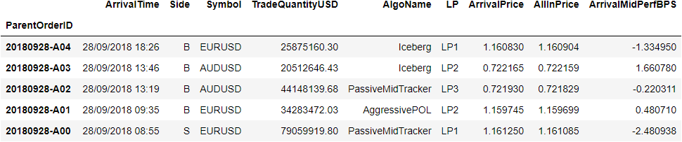<figcaption></figcaption></figure>

#### Parent Order Stats

***

Please refer to [Parent Orders Stats](https://docs.analytics.tradefeedr.com/docs/api_algo/api_algo_parent_order_stats.html) for more details and examples. Refer to Algo API page for page for details on aggregation logic.

The `v1/fx/algo/parent-order-stats` endpoint is designed to study algo performance metrics aggregated across user defined categories like `Symbol` or `LP`. You can use this endpoint to rank the trading performance of their algos by LP to see how they compare. The below example shows how the data can be aggregated by `LP`.

**Return all available benchmarks (`performance`)**

***

Refer to [Algo API](https://docs.analytics.tradefeedr.com/docs/api_algo/api_algo.html) page for page for details on aggregation logic.

In the following example, the results are aggregated by `LP` and all available benchmarks are returned. By grouping by `LP` we can compare the performance across each `LP` on a number of benchmarks. Below we are using the `TradefeedrModel` for the `risk_price_benchmark` and `notation` is set to `performance`. As a result the algo statistics are expressed in terms of basis points.

```python
## tradefeedr library
from tradefeedr_public_content.v1.generic.tradefeedr_api import TradefeedrApi

## need pandas to translate JSON results from API
import pandas as pd

## create API object
tf_api_object = TradefeedrApi(demo=True)

## options
options = {
    "groupby": [
        "LP"
    ],
      "filter": [
          {"function": "within", "var": "Date", "pars": ["2018-01-01", "2018-12-31"]},
          {"function": "eq", "var": "Symbol", "par": "EURUSD"},
          {"function": "within", "var": "ArrivalTime", "transform": "time", "pars": ["09:00:00", "20:00:00"]}
    ],
    "risk_price_benchmark": "TradefeedrModel",
    "notation": "performance"
}

# this is api end-point which returns parent order stats
endpoint = "v1/fx/algo/parent-order-stats"

## call the API
response = tf_api_object.query_api(endpoint, options)

## translate API result into pandas dataframe
data_frame = pd.DataFrame(response["result"])
# data_frame = data_frame.set_index("LP")
data_frame
```

**Results**

***

<figure><figcaption></figcaption></figure>

#### Execution Stats

***

Please refer to [Execution Stats](https://docs.analytics.tradefeedr.com/docs/api_algo/api_algo_execution_stats.html) for more details and examples. Refer to Algo API page for page for details on aggregation logic.

The `v1/fx/algo/execution-stats` endpoint is used when you seek to study general algo execution patterns, anything from child fill quality and market impact of individual child fills to user specific events. For example, you can create a venue analysis using this endpoint, by comparing spread paid and market impact generated by different LPs.

**Venue Analysis**

***

Venue analysis is a popular way to assess the quality of child execution. Typically aggressive (or taker) fills are expected to pay spread (`SpreadPnLPM` in the below) and passive (maker) fills are expected to receive spread (pay negative spread). It is also important what the market does after a fill.

`DecayPM1s` measures side-adjusted move in **$/m**. A positive number means that that market mid went **up** after a buy fill and **down** after sell fill.

```python
## tradefeedr library
from tradefeedr_public_content.v1.generic.tradefeedr_api import TradefeedrApi

## need pandas to translate JSON results from API
import pandas as pd

## create API object
tf_api_object = TradefeedrApi(demo=True)

## options
options = {
    "groupby": [
        "AlgoVendor",  # this is the institution responsible for the overall execution of algo
        "LP",          # this is the actual LP for the child order -  can be same as AlgoVendor
        "ExecVenue",   # venue where trading takes place -  can be "CboeFX", "EuronextFX"
        "OrderType",   # this should be "Market" or "Limit" or "Aggressive" or "Passive"
        "LiqPool"      # this can be specific liquidity pool like "no last look"
    ],
    "select": [
        "TradeQuantityUSD",
        "SpreadPnLPM", # spread paid in $/m, see definition in the end of the doc
        "DecayPM1s",
        "DecayPM5s"
    ],
    "filter": [
        {"function": "eq", "var": "ParentChild", "par": "Child"},
        {"function": "within", "var": "TradeTime", "transform": "time", "pars": ["12:00:00", "14:00:00"]},
        {"function": "within", "var": "Date", "pars": ["2014-01-01", "2021-11-30"]},
        {"function": "in", "var": "Symbol", "pars": ["EURUSD", "USDJPY"]}
    ]
}

# this is api end-point which returns execution stats
endpoint = "v1/fx/algo/execution-stats"

## call the API
response = tf_api_object.query_api(endpoint, options)

## translate API result into pandas dataframe
data_frame = pd.DataFrame(response["result"])
# data_frame = data_frame.set_index("AlgoVendor")
data_frame
```

**Results**

***

<figure><figcaption></figcaption></figure>

**Figure**

***

```python
# import plotly libary
import plotly.express as px

# Modify dataframe
data_frame = data_frame[data_frame.LP=="LP1"].set_index("ExecVenue")

# Plot figure
fig = px.bar(data_frame["SpreadPnLPM"], title="LP1 ExecVenue Analysis")
fig.update_layout(xaxis={"categoryorder":"total ascending"})
fig.show()
```

<figure>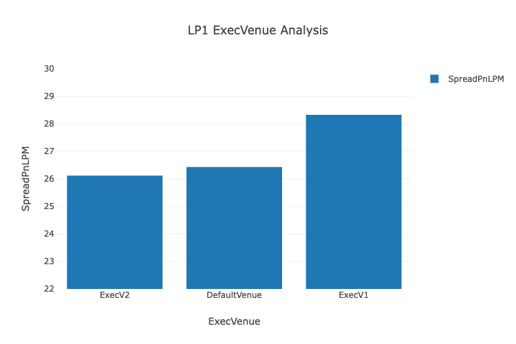<figcaption></figcaption></figure>

#### Markouts

***

Please refer to [Markouts](https://docs.analytics.tradefeedr.com/docs/api_algo/api_algo_markouts.html) for more details and examples.

The `v1/fx/algo/markouts` is used to review the markout curves. You can query a specific `ParentOrderID` and obtain the respective markout curve.

**Markouts by ParentOrderID**

***

The query below returns all the markout curve information for a single `ParentOrderID`. This data can be used to visualise a markout curve as shown below.

```python
## tradefeedr library
from tradefeedr_public_content.v1.generic.tradefeedr_api import TradefeedrApi

## need pandas to translate JSON results from API
import pandas as pd

## create API object
tf_api_object = TradefeedrApi(demo=True)

## options
options = {
    "groupby": ["ParentOrderID"],
    "filter": [
        {"function": "like", "var": "ParentChild", "par": "Child"},
        {"function": "like", "var": "ParentOrderID", "par": "20180921-A00"},
    ],
}

# this is api end-point which returns markouts
endpoint = "v1/fx/algo/markouts"

## call the API
response = tf_api_object.query_api(endpoint, options)

## translate API result into pandas dataframe
data_frame = pd.DataFrame(response["result"])
# data_frame = data_frame.set_index("ParentOrderID")
data_frame
```

**Results**

***

<figure><figcaption></figcaption></figure>

**Figure**

***

```python
# import plotly libary
import plotly.express as px
import plotly.graph_objs as go

# Modify dataframe
data_frame = data_frame.set_index("MarkoutType").iloc[:,3:].T
data_frame = data_frame[["Markouts", "Volatilities"]]

# Plot figure
fig = px.line(data_frame, y="Markouts", title ="Markouts with Volatility Bands For POID:20180921-A00")

fig["data"][0]["name"] = "Markouts"
fig["data"][0]["showlegend"] = True

fig.add_trace(go.Scatter(y=data_frame["Markouts"]-data_frame["Volatilities"], x=data_frame.index, mode="lines",
                         fill="tonexty", name="Confidence Interval 2"))
fig.add_trace(go.Scatter(y=data_frame["Markouts"]+data_frame["Volatilities"], x=data_frame.index, mode="lines",
                         fill="tonexty", name="Confidence Interval 1"))
fig.show()
```

<figure>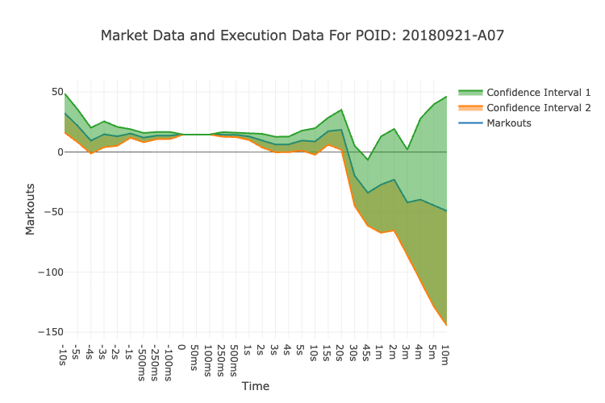<figcaption></figcaption></figure>

#### Event History

***

Please refer to [Event History](https://docs.analytics.tradefeedr.com/docs/api_algo/api_algo_event_history.html) for more details and examples.

The `v1/fx/algo/event-history` endpoint is used for obtaining detailed analysis and understanding of a specific `ParentOrderID` execution profile.

**Event History for a ParentOrderID**

***

This example shows how to obtain the event history of a single `ParentOrderID` we are interested in.

The endpoint allows selection of multiple metrics (fields) such as spread paid and market impact at different time horizons (corresponding to each child order event available in the Tradefeedr database).

```python
## tradefeedr library
from tradefeedr_public_content.v1.generic.tradefeedr_api import TradefeedrApi

## need pandas to translate JSON results from API
import pandas as pd

## create API object
tf_api_object = TradefeedrApi(demo=True)

## options
options = {
    "select": [
        "ParentChild",
        "ParentOrderID",
        "TradeID",
        "Symbol",
        "Side",
        "TradeCcy",
        "TradeQuantityUSD",
        "OrderQuantity",
        "Price",
        "OrderType",
        "ExecVenue",
        "Mid0",
        "Mid1s",
        "DecayPM1s",
        "SpreadPnLPM",
        "ArrivalTime",
        "TradeTime"
    ],
    "filter": [
        {"function": "eq", "var": "ParentOrderID", "par": "20180903-A00"}
    ]
}

# this is api end-point which returns parent order stats one algo run per row
endpoint = "v1/fx/algo/event-history"

## call the API
response = tf_api_object.query_api(endpoint, options)

## translate API result into pandas dataframe
data_frame = pd.DataFrame(response["result"])
# data_frame = data_frame.set_index("ParentChild")

## translate TradeTime and ArrivalTime to human readable time
data_frame["TradeTime"] = pd.to_datetime(data_frame["TradeTime"],  unit="ms" if str(data_frame["TradeTime"].dtype) == "int64" else None)
data_frame["ArrivalTime"] = pd.to_datetime(data_frame["ArrivalTime"],  unit="ms" if str(data_frame["ArrivalTime"].dtype) == "int64" else None)
data_frame = data_frame.sort_values(by="ArrivalTime", ascending=False)
data_frame
```

**Results**

***

<figure><figcaption></figcaption></figure>

**Figures**

***

```python
# import plotly libary
import plotly.express as px

# Modify dataframe
data_frame = data_frame.set_index("ArrivalTime")


# Plot figure 1
fig = px.line(data_frame[data_frame.ParentChild=="Child"][["TradeQuantityUSD"]],
             title="Child Fills TradeQuantityUSD")

fig.show()

# Plot figure 2
fig = px.line(data_frame[data_frame.ParentChild=="Child"][["Price", "Mid0"]],
             title="Price and Mid Price of Child Fills ")
fig.show()

# Plot figure 3
fig = px.line(data_frame[data_frame.ParentChild=="Child"][["SpreadPnLPM"]],
             title="Child Fills SpreadPnLPM")

fig.show()
```

<figure>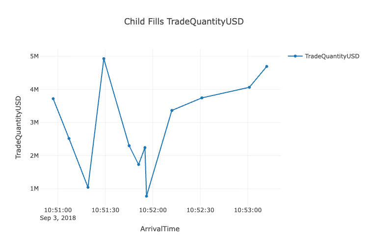<figcaption></figcaption></figure>

<figure>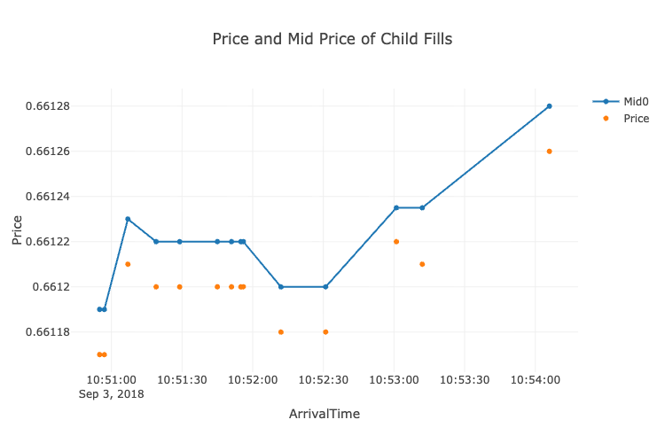<figcaption></figcaption></figure>

<figure><figcaption></figcaption></figure>

### RFS

#### Introduction

***

RFS is Request For Streaming. Prices for different currency pair/instrument and for different quantities are sent down a connection by the Liquidity providers (LPs). The connection may be used by one liquidity consumer (LC) or shared by multiple.

Tradefeedr supports both forms of RFS stream:

* **Aggregated** - sweep flow where the liquidity consumer evaluates multiple liquidity providers and trades at the same time to fill the order
* **Full Amount** - single ticket flow where the full order amount is traded with one LP

For more details on RFS analytics refer to the [Analytics RFS](https://docs.analytics.tradefeedr.com/docs/analytics_rfs.html) page.

#### Summary Stats

***

Please refer to [Summary Stats](https://docs.analytics.tradefeedr.com/docs/api_rfs/api_rfs_summary_stats.html) for more details and examples. Refer to RFS API page for page for details on aggregation logic.

The `v1/fx/rfs/summary_stats` provides a report on the trading performance focusing on the spreads and reject rates. The endpoint returns standard flow quality metrics such as trading volume, spread paid, rejection costs, market impact (flow toxicity). This endpoint is used when you seek a summary of the fill quality that their LPs are providing them.

**Default aggregation**

***

When omitting query parameters, the default aggregation logic is used.

Refer to [RFS API](https://docs.analytics.tradefeedr.com/docs/api_rfs/api_rfs.html) page for page for details on aggregation logic.

```python
## tradefeedr library
from tradefeedr_public_content.v1.generic.tradefeedr_api import TradefeedrApi

## need pandas to translate JSON results from API
import pandas as pd

## create API object
tf_api_object = TradefeedrApi(demo=True)

## options
options = {
      "groupby":[
      ],
      "filter":[
      ]
}

# this is api end-point which returns summary stats
endpoint = "v1/fx/rfs/summary-stats"

## call the API
response = tf_api_object.query_api(endpoint, options)

## translate API result into pandas dataframe
data_frame = pd.DataFrame(response["result"])
# data_frame = data_frame.set_index("NumbeOfFills")
data_frame
```

**Results**

***

<figure><figcaption></figcaption></figure>

#### Execution Stats

***

Please refer to [Execution Stats](https://docs.analytics.tradefeedr.com/docs/api_rfs/api_rfs_execution_stats.html) for more details and examples. Refer to RFS API page for page for details on aggregation logic.

The `v1/fx/rfs/execution-stats` endpoint is similar in nature to `v1/fx/algo/execution-stats`, as it is used to study the general execution quality of the trades and their associated market impact; however, it is for RFS trades.

**Only `LP` in `groupby`**

***

Refer to [RFS API](https://docs.analytics.tradefeedr.com/docs/api_rfs/api_rfs.html) page for page for details on aggregation logic.

**Note:** Aggregation is different depending on the `select` and `groupby` fields

* In general, numerical fields are aggregated using a sum or weighted-average where appropriate.
* The default aggregation for fields which contain string variables is `None` unless `TradeID` is present in `groupby`.
* However, you may define a function in the `select` option to aggregate fields as they wish.

In the example below we groupby `LP`, numerical fields such as `Price`,`Mid0` return `None` as we aggregate across `Symbol` and `Side`. The aggregation of these fields does not return a meaningful result.

```python
## tradefeedr library
from tradefeedr_public_content.v1.generic.tradefeedr_api import TradefeedrApi

## need pandas to translate JSON results from API
import pandas as pd

## create API object
tf_api_object = TradefeedrApi(demo=True)

## options
options = {
    "groupby": [
        "LP",
    ],
    "select": [

        "TradeQuantityUSD", # sum
        "SpreadPnLPM",      # TradeQuantityUSD-weighted average
        "DecayPM1s",        # TradeQuantityUSD-weighted average
        "Symbol",           # cannot aggregate - returns None
        "ExecVenue",        # cannot aggregate - returns None
        "Mid0",             # cannot aggregate - returns None
        "Price",            # cannot aggregate - returns None
        {"function": "sum", "var": "TradeQuantityUSD", "name": "TotalVolume"},      # explicit aggregation function
        {"function": "avg", "var": "Price", "name": "AvgPrice"}                     # explicit aggregation function
    ],
    "filter": [
        #{"function": "within", "var": "Date", "pars": ["2014-01-01", "2021-11-30"]},
        {"function": "within", "var": "TradeTime", "transform": "time", "pars": ["12:00:00", "14:00:00"]},
        {"function": "in", "var": "Symbol", "pars": ["EURUSD", "USDJPY"]},
        {"function": "eq", "var": "ParentChild", "par": "Child"}
    ],
}

# this is api end-point which returns execution stats
endpoint = "v1/fx/rfs/execution-stats"

## call the API
response = tf_api_object.query_api(endpoint, options)

## translate API result into pandas dataframe
data_frame = pd.DataFrame(response["result"])
# data_frame = data_frame.set_index("LP")
data_frame
```

**Results**

***

<figure><figcaption></figcaption></figure>

#### Execution History

***

Please refer to [Execution History](https://docs.analytics.tradefeedr.com/docs/api_rfs/api_rfs_execution_history.html) for more details and examples.

The `v1/fx/rfs/execution-history` endpoint is used when you require a detailed analysis and understanding of a specific trading `Date`. It returns a very granular resultset for a given trading day.

**Execution History for a ParentOrderID**

***

```python
## tradefeedr library
from tradefeedr_public_content.v1.generic.tradefeedr_api import TradefeedrApi

## need pandas to translate JSON results from API
import pandas as pd

## create API object
tf_api_object = TradefeedrApi(demo=True)

## options
options =  {
    "select":["TradeTime",
              "OrderStatus",
              "TradeQuantityUSD",
              "Symbol",
              "Side",
              "Price",
              "SpreadPnL",
              "DecayNeg10s",
              "DecayPMNeg10s",
              "Mid0",
              "Decay30s",
              "DecayPM30s"
             ],
    "filter":[
        {"function":"eq","var":"Date","par":"2017-02-02"},
    ]
}

# this is api end-point which returns execution history
endpoint =  "v1/fx/rfs/execution-history"

## call the API
response = tf_api_object.query_api(endpoint, options)

## translate API result into pandas dataframe
data_frame = pd.DataFrame(response["result"])

## translate TradeTime to human readable time
data_frame["TradeTime"] = pd.to_datetime(data_frame["TradeTime"], unit="ms" if str(data_frame["TradeTime"].dtype) == "int64" else None)

# data_frame = data_frame.set_index("TradeTime")
data_frame
```

**Results**

***

<figure><figcaption></figcaption></figure>

**Figure**

***

```python
# import plotly libary
import plotly.express as px

# Plot figure
fig = px.scatter(data_frame, x="TradeTime", y="TradeQuantityUSD",
                 title="Volume Traded by TradeTime", color="Symbol")

fig.show()
```

<figure>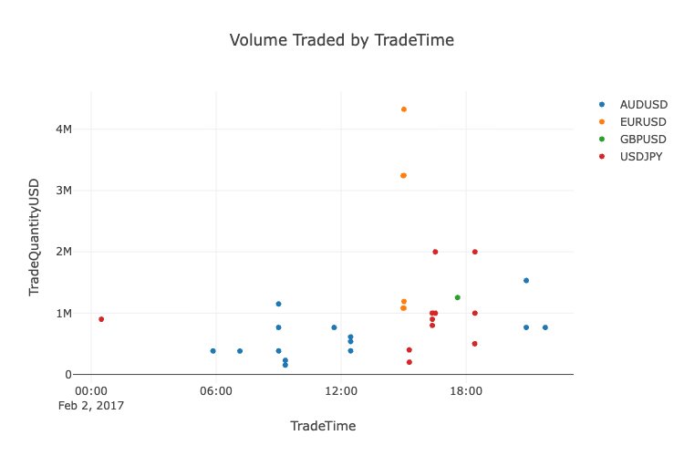<figcaption></figcaption></figure>

#### Markouts

***

Please refer to [Markouts](https://docs.analytics.tradefeedr.com/docs/api_rfs/api_rfs_markouts.html) for more details and examples.

The `v1/fx/rfs/markouts` endpoint is used to review the markout curves. You can query a specific `ParentOrderID` and obtain the respective markout curve.

**Markouts by LP**

***

```python
## tradefeedr library
from tradefeedr_public_content.v1.generic.tradefeedr_api import TradefeedrApi

## need pandas to translate JSON results from API
import pandas as pd

## create API object
tf_api_object = TradefeedrApi(demo=True)

## options
options = {
    "groupby": [
        "LP"
    ],
    "filter": [
        {"function": "like", "var": "ParentChild", "par": "Child"}
    ]
}

# this is api end-point which returns markouts
endpoint =  "v1/fx/rfs/markouts"

## call the API
response = tf_api_object.query_api(endpoint, options)

## translate API result into pandas dataframe
data_frame = pd.DataFrame(response["result"])
# data_frame = data_frame.set_index("LP")
data_frame
```

**Results**

***

<figure><figcaption></figcaption></figure>

**Figure**

***

```python
# import plotly libary
import plotly.express as px

# Modify dataframe
data_frame = data_frame[data_frame.MarkoutType=="Markouts"]
data_frame = data_frame.set_index("LP")

# Plot figure
fig = px.line(data_frame.iloc[:,3:].T, title="Markouts by LP")
fig.update_xaxes(title="Time")
fig.update_yaxes(title="Markouts")
fig.show()
```

<figure>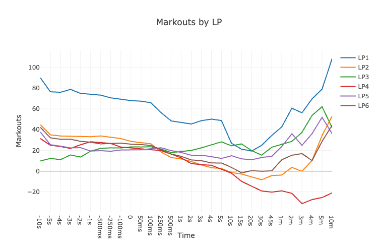<figcaption></figcaption></figure>

### RFS Bilateral

#### Introduction

***

Tradefeedr takes the transactions data from client databases, removes all the sensitive information and aggregates it before sharing this aggregated and cleaned information with LPs of client choice.

For more details on RFS Bilateral analytics refer to the [Analytics Bilateral Sharing](https://docs.analytics.tradefeedr.com/docs/analytics_bilateral_sharing.html) page.

#### Bilateral Aggregates

***

Please refer to [Aggregates](https://docs.analytics.tradefeedr.com/docs/api_rfs_bilateral/api_rfs_bilateral_aggregates.html) for more details and examples. Refer to RFS Bilateral API page for page for details on aggregation logic.

The `v1/fx/rfs/bilateral-aggregates` endpoint is similar to the `v1/fx/rfs/execution-stats` endpoint. However, the data has been anonymized to mask the `LP` names. Like the `v1/fx/rfs/execution-stats` endpoint it is used to investigate the execution quality of the trades and their associated market impact.

**LP Analysis - Spread Paid and Market Impact**

***

Refer to [RFS Bilateral API](https://docs.analytics.tradefeedr.com/docs/api_rfs_bilateral/api_rfs_bilateral.html) page for page for details on aggregation logic.

In this example we conduct a `LP` analysis where we group the results by `LP`, `Symbol` and `OrderStatus` . This is to review the overall quality of the liquidity of each `LP`.

`DecayPM1s` measures side-adjusted move in $/m.

Positive number means that that market mid goes up after a **buy** fill and down after **sell** fill.

Grouping by `OrderStatus` allows you to differentiate the markout curves between filled and rejected trades.

```python
## tradefeedr library
from tradefeedr_public_content.v1.generic.tradefeedr_api import TradefeedrApi

## need pandas to translate JSON results from API
import pandas as pd

## create API object
tf_api_object = TradefeedrApi(demo=True)

## options
options = {
    "groupby": [
        "LP",          # this is the actual LP for the child order -  can be same as AlgoVendor
        "Symbol",
        "OrderStatus"
    ],
    "select": [
        "TradeQuantityUSD",
        "SpreadPnLPM", # spread paid in $/m, see definition in the end of the doc
        "DecayPM1s",
        "DecayPM5s",
        "DecayPM30s",
        "DecayPM1m",
        "DecayPM5m"
    ],
    "filter": [
        {"function": "within", "var": "Date", "pars": ["2017-01-01", "2017-12-31"]},
        {"function": "like", "var": "Symbol", "par": "USD*"}
    ]
}

# this is api end-point which returns bilateral aggregates
endpoint =  "v1/fx/rfs/bilateral-aggregates"

## call the API
response = tf_api_object.query_api(endpoint, options)

## translate API result into pandas dataframe
data_frame = pd.DataFrame(response["result"])
# data_frame = data_frame.set_index("LP")
data_frame
```

**Results**

***

<figure><figcaption></figcaption></figure>

**Figure**

***

```python
# import plotly libary
import plotly.express as px

# Modify dataframe
data_frame = data_frame[data_frame.Symbol=="USDJPY"]
data_frame = data_frame.sort_values(by="DecayPM30s", ascending=False)

# Plot figure 1
fig = px.bar(data_frame[data_frame.OrderStatus=="F"], x="LP", y="DecayPM30s",
             title="Filled Trades: USDJPY DecayPM30s by LP")
fig.show()

# Plot figure 2
fig = px.bar(data_frame[data_frame.OrderStatus=="R"], x="LP", y="DecayPM30s",
             title="Rejected Trades :USDJPY DecayPM30s by LP")
fig.show()
```

<figure>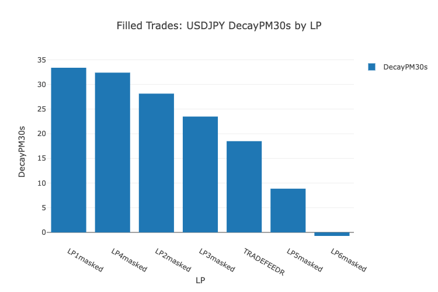<figcaption></figcaption></figure>

<figure>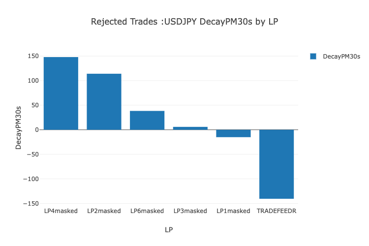<figcaption></figcaption></figure>

#### Markouts

***

Please refer to [Markouts](https://docs.analytics.tradefeedr.com/docs/api_rfs_bilateral/api_rfs_bilateral_markouts.html) for more details and examples.

The `v1/fx/rfs/bilateral-markouts` is similar to the `v1/fx/rfs/markouts` endpoint but `LP` masking has been applied.

**Markouts by LP ,Symbol and OrderStatus**

***

In this example we query `MarkoutType` equal to `Markouts` and select the points in time of the markout curve. The results are then filtered for fills only, this allows you to assess the impact of the filled trades.

```python
## tradefeedr library
from tradefeedr_public_content.v1.generic.tradefeedr_api import TradefeedrApi

## need pandas to translate JSON results from API
import pandas as pd

## create API object
tf_api_object = TradefeedrApi(demo=True)

## options
options = {
    "groupby": [
        "LP",
        "Symbol",
        "OrderStatus"
    ],
    "select": [
        "TradeQuantityUSD",
        "-5s",
        "-1s",
        "0",
        "5s",
        "10s",
        "30s",
        "1m",
        "3m",
        "5m"
    ],
    "filter": [
        {"function": "eq", "var": "OrderStatus", "par": "F"},
        {"function": "gt", "var": "TradeQuantityUSD", "par": 1000000},
        {"function": "eq", "var": "MarkoutType", "par": "Markouts"},
        {"function": "eq", "var": "Symbol", "par": "EURUSD"}
   ]
}

# this is api end-point which returns bilateral markouts
endpoint =  "v1/fx/rfs/bilateral-markouts"

## call the API
response = tf_api_object.query_api(endpoint, options)

## translate API result into pandas dataframe
data_frame = pd.DataFrame(response["result"])
# data_frame = data_frame.set_index("LP")
data_frame
```

**Results**

***

<figure><figcaption></figcaption></figure>

**Figure**

***

```python
# import plotly libary
import plotly.express as px

# Modify dataframe
data_frame = data_frame.set_index("LP")

# Plot figure
fig = px.line(data_frame.iloc[:,3:].T, title="Markout Curves")
fig.show()
```

<figure>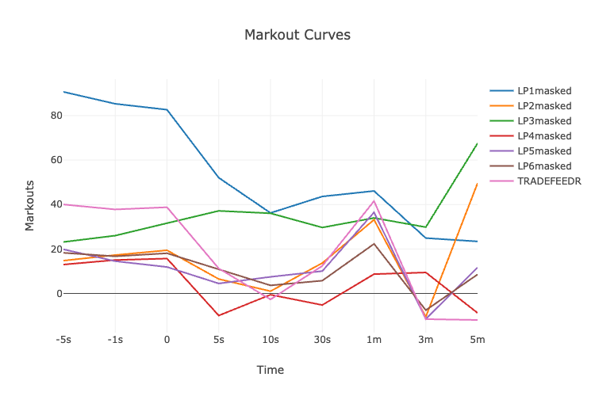<figcaption></figcaption></figure>

#### Market Share

***

Please refer to [Market Share](https://docs.analytics.tradefeedr.com/docs/api_rfs_bilateral/api_rfs_bilateral_market_share.html) for more details and examples.

`v1/fx/rfs/bilateral-market-share` allows you to query `MarketShare` history by `Date`. It is used to track how the `MarketShare` over a period of days changes. You can use this endpoint to see how their `MarketShare` varied over the last year for a specific `LP` and selected `Symbol`(s).

**LP Market Share Analysis**

***

This example shows you how to apply the `filter` parameter to highlight the market share the `LP` (`LP1masked`) contributes to you (`TRADEFEEDR`).

**Note:** The use of `TRADEFEEDR` is for demo purposes only, this will differ when demo data is turned off. You will need to change this to their own `LP` name.

```python
## tradefeedr library
from tradefeedr_public_content.v1.generic.tradefeedr_api import TradefeedrApi

## need pandas to translate JSON results from API
import pandas as pd

## create API object
tf_api_object = TradefeedrApi(demo=True)

## options
options = {
    "filter": [
        {"function": "eq", "var": "CreatedFor", "par": ""},
        {"function": "in", "var": "LP", "pars": ["TRADEFEEDR","LP1masked"]},
        {"function": "within", "var": "Date", "par": ["2017-02-01", "2017-02-10"]}
    ]
}

# this is api end-point which returns bilateral market share
endpoint =  "v1/fx/rfs/bilateral-market-share"

## call the API
response = tf_api_object.query_api(endpoint, options)

## translate API result into pandas dataframe
data_frame = pd.DataFrame(response["result"])
# data_frame = data_frame.set_index("Date")
data_frame
```

**Results**

***

<figure><figcaption></figcaption></figure>

**Figure**

***

```python
# import plotly libary
import plotly.express as px

# Plot figure
fig = px.line(data_frame, x="Date", y="MarketShare", title="LP Market Share Analysis 2", color="LP")
fig.show()
```

<figure>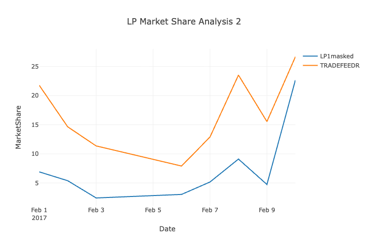<figcaption></figcaption></figure>

### RFQ

#### Introduction

***

RFQ is defined as a transaction that happens in several steps:

1. Liquidity consumer (LC) identifies a set (henceforth referred to as **LP stack**) of Liquidity providers (LPs)
2. LC send a request for quotes in a given size and currency pair/instrument. The quote request can be two-sided (asking for bid and offer) or one-sided
3. LC waits for some time for the LPs to return with quotes
4. LC selects the best quote according to some rules (in vast majority of cases it is simply highest bid or lowest offer depending on the side)

RFQ data is typically submitted to the Tradefeedr by RFQ platforms so each transaction both winning LP quotes and losing LP quotes.

For more details on RFQ analytics refer to the [Analytics RFQ](https://docs.analytics.tradefeedr.com/docs/analytics_rfq.html) page.

#### Execution History

***

For outrights refer to [Outrights Execution History](https://docs.analytics.tradefeedr.com/docs/api_rfq/api_rfq_outrights_execution_history.html) for more details and examples.

For swaps refer to [Swaps Execution History](https://docs.analytics.tradefeedr.com/docs/api_rfq/api_rfq_swaps_execution_history.html) for more details and examples.

The `v1/fx/rfq-outrights/execution-history` and `v1/fx/rfq-swaps/execution-history` endpoints allow you to query all trading events for outrights/swaps RFQ . It should be used when you require a detailed analysis and understanding of the execution.

**Select Metrics (Fields) for a Date Range**

***

The example below shows how to use the outrights endpoint to filter for a range of days. This allows you to evaluate the executions over a period of time.

Below we have used this data to plot the `TradeQuantity` to analyse the trend in volume traded.

```python
## tradefeedr library
from tradefeedr_public_content.v1.generic.tradefeedr_api import TradefeedrApi

## need pandas to translate JSON results from API
import pandas as pd

## create API object
tf_api_object = TradefeedrApi(demo=True)

## options
options = {
    "select":[
        "Date",
        "Account",
        "TradeTime",
        "Symbol",
        "TradeCcy",
        "Side",
        "TradeQuantity",
        "ProductType"
    ],
    "filter":[
        {"function":"within","var":"Date","pars":["2021-04-02", "2021-06-30"]}
    ]
}

# this is api end-point which returns RFQ outrights execution history
endpoint =  "v1/fx/rfq-outrights/execution-history"

## call the API
response = tf_api_object.query_api(endpoint, options)

## translate API result into pandas dataframe
data_frame = pd.DataFrame(response["result"])

## translate TradeTime to human readable time
data_frame["TradeTime"] = pd.to_datetime(data_frame["TradeTime"], unit="ms" if str(data_frame["TradeTime"].dtype) == "int64" else None)

# data_frame = data_frame.set_index("Date")
data_frame
```

**Results**

***

<figure><figcaption></figcaption></figure>

**Figure**

***

```python
# import plotly libary
import plotly.express as px

# Modify dataframe
data_frame=data_frame.groupby("Date").sum()

# Plot figure
fig = px.line(data_frame, y="TradeQuantity", title="Daily Traded Volume")
fig.show()
```

<figure><figcaption></figcaption></figure>

#### Execution Stats

***

For outrights refer to [Outrights Execution Stats](https://docs.analytics.tradefeedr.com/docs/api_rfq/api_rfq_outrights_execution_stats.html) for more details and examples.

For swaps refer to [Swaps Execution Stats](https://docs.analytics.tradefeedr.com/docs/api_rfq/api_rfq_swaps_execution_stats.html) for more details and examples.

The `v1/fx/rfq-outrights/execution-stats` and `v1/fx/rfq-swaps/execution-stats` endpoints allow you to query across the entire execution history. The endpoint is designed to study general execution quality of the trades.

**Only `LP` in `groupby`**

***

Aggregation is different depending on `select` and `groupby` fields. Only `TradeQuantityUSD` and `Price` have a default aggregation logic assigned to it.

* You may define a function in the select option to aggregate the fields as they wish to.

In the example below we groupby `LP`, numerical fields such as `Price` return `None` as we aggregate across `Symbol` and `Side`. The aggregation of these fields does return a meaningful result.

```python
## tradefeedr library
from tradefeedr_public_content.v1.generic.tradefeedr_api import TradefeedrApi

## need pandas to translate JSON results from API
import pandas as pd

## create API object
tf_api_object = TradefeedrApi(demo=True)

## options
options = {
    "groupby": [
        "LP"
    ],
    "select": [
        "TradeQuantityUSD", # sum
        "Symbol",           # cannot aggregate - returns None
        "Side",             # cannot aggregate - returns None
        "Price",            # cannot aggregate - returns None
        "NumLPs",           # default aggregation not defined - returns None, need to use user defined function to aggregate
        "SecondBestPrice",  # default aggregation not defined - returns None, need to use user defined function to aggregate
        "BestBid",          # default aggregation not defined - returns None, need to use user defined function to aggregate
        "BestAsk",          # default aggregation not defined - returns None, need to use user defined function to aggregate
        {"function": "sum", "var": "TradeQuantityUSD", "name": "TotalVolume"}       # explicit aggregation function
    ],
    "filter": [
        {"function": "within", "var": "Date", "pars": ["2014-01-01", "2021-11-30"]},
        {"function": "within", "var": "TradeTime", "transform": "time", "pars": ["12:00:00", "14:00:00"]}
    ],
}

# this is api end-point which returns RFQ outrights execution stats
endpoint =  "v1/fx/rfq-outrights/execution-stats"

## call the API
response = tf_api_object.query_api(endpoint, options)

## translate API result into pandas dataframe
data_frame = pd.DataFrame(response["result"])
# data_frame = data_frame.set_index("LP")
data_frame
```

**Results**

***

Most feilds return nulls as only `TradeQuantityUSD` and `Price` have a default aggregation logic assigned to it.

The user will have to create user defined functions, please refer to the User defined field names example in the [Outrights Execution Stats](https://docs.analytics.tradefeedr.com/docs/api_rfq/api_rfq_outrights_execution_stats.html) page.

<figure><figcaption></figcaption></figure>

#### Opportunity Report

***

For outrights refer to [Outrights Opportunity Report](https://docs.analytics.tradefeedr.com/docs/api_rfq/api_rfq_outrights_opportunity_report.html) for more details and examples.

For swaps refer to [Swaps Opportunity Report](https://docs.analytics.tradefeedr.com/docs/api_rfq/api_rfq_swaps_opportunity_report.html) for more details and examples.

The `v1/fx/rfq-outrights/opportunity-report` and `v1/fx/rfq-swaps/opportunity-report` endpoints are used to create a report to display the `OutCome` of the outrights/swaps RFQ if it was `WON` or `LOST`.

**Select Losing RFQs only**

***

Below we have filtered the `OutCome` column to select only the cases where the RFQ was `LOST`. You can review these cases to see how far off the price was from the winning quote.

```python
## tradefeedr library
from tradefeedr_public_content.v1.generic.tradefeedr_api import TradefeedrApi

## need pandas to translate JSON results from API
import pandas as pd

## create API object
tf_api_object = TradefeedrApi(demo=True)

## options
options =  {
    "select":[
        "LP",
        "OutCome",
        #"Symbol",
        "TradeCcy",
        "Side",
        "TradeTime",
        "ProductType",
        "PriceShown",
        "MissedByPIPS"
    ],
    "filter":[
        {"function":"within","var":"date","pars":["2014-01-01","2021-11-30"]},
        {"function":"like","var":"LP","par": "LP*"},
        {"function":"eq","var":"OutCome","par":"LOST"},
    ],
}

# this is api end-point which returns RFQ outrights opportunity report
endpoint =  "v1/fx/rfq-outrights/opportunity-report"

## call the API
response = tf_api_object.query_api(endpoint, options)

## translate API result into pandas dataframe
data_frame = pd.DataFrame(response["result"])
# data_frame = data_frame.set_index("LP")

## translate TradeTime to human readable time
data_frame["TradeTime"] = pd.to_datetime(data_frame["TradeTime"], unit="ms" if str(data_frame["TradeTime"].dtype) == "int64" else None)   
data_frame
```

**Results**

***

<figure><figcaption></figcaption></figure>

**Figure**

***

```python
# import plotly libary
import plotly.express as px

# Modify dataframe
data_frame = data_frame[data_frame.TradeCcy=="AUD"].head(50)

# Plot figure
fig = px.scatter(data_frame, x="TradeTime" , y="MissedByPIPS", title="Selecting Losing RFQs only (TradeCcy:AUD)")
fig.show()
```

<figure>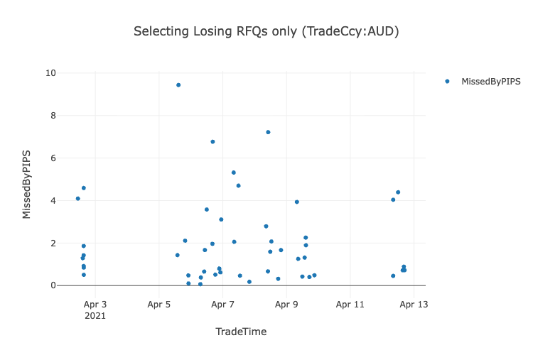<figcaption></figcaption></figure>

#### Participation Report

***

For outrights refer to [Outrights Participation Report](https://docs.analytics.tradefeedr.com/docs/api_rfq/api_rfq_outrights_participation_report.html) for more details and examples.

For swaps refer to [Swaps Participation Report](https://docs.analytics.tradefeedr.com/docs/api_rfq/api_rfq_swaps_participation_report.html) for more details and examples.

The `v1/fx/rfq-outrights/participation-report` and `v1/fx/rfq-swaps/participation-report` endpoints are used when you seek a summary of the outrights/swaps RFQ participation rate by `LP`.

This endpoint is used to study the hit ratios of the requested outrights/swaps RFQs, you can rank each `LP` against various performance ratios. Such as `ActualWinRatio`, `ActualVolumeWinRatio`, `WinPerformanceScore` etc.

The example below is for the outrights endpoint.

**Default Results**

***

The default response of the API query returns all available performance ratios. You can review how many RFQs they have participated in and how many of those they have won. In the figure below we have plotted the `NumberOfWins` alongside the `ExpectedWins`.

* `ExpectedWins` is 1/PanelSize \* number of RFQs the LP participated in.

For example for LP participating in 20 RFQ each with 4 LPS the expected number of wins will be 20 x (1/4) = 5

```python
## tradefeedr library
from tradefeedr_public_content.v1.generic.tradefeedr_api import TradefeedrApi

## need pandas to translate JSON results from API
import pandas as pd

## create API object
tf_api_object = TradefeedrApi(demo=True)

## options
options =  {
    "filter":[
    ]
}

# this is api end-point which returns RFQ outrights participation report
endpoint =  "v1/fx/rfq-outrights/participation-report"

## call the API
response = tf_api_object.query_api(endpoint, options)

## translate API result into pandas dataframe
data_frame = pd.DataFrame(response["result"])
# data_frame = data_frame.set_index("LP")
data_frame
```

**Results**

***

<figure><figcaption></figcaption></figure>

**Figure**

***

```python
# import plotly libary
import plotly.express as px

# Plot figure
fig = px.bar(data_frame, x="LP", y=["NumberOfWins", "ExpectedWins"],
             barmode="group", title="Number of Outright RFQs Won by LP")
fig.show()
```

<figure>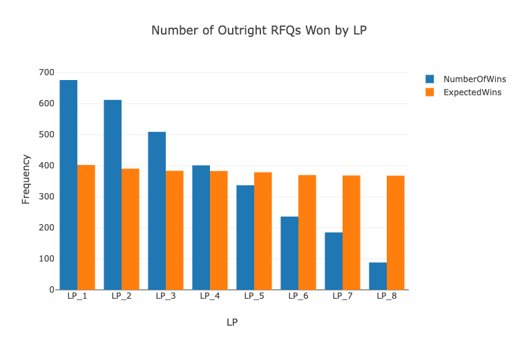<figcaption></figcaption></figure>
